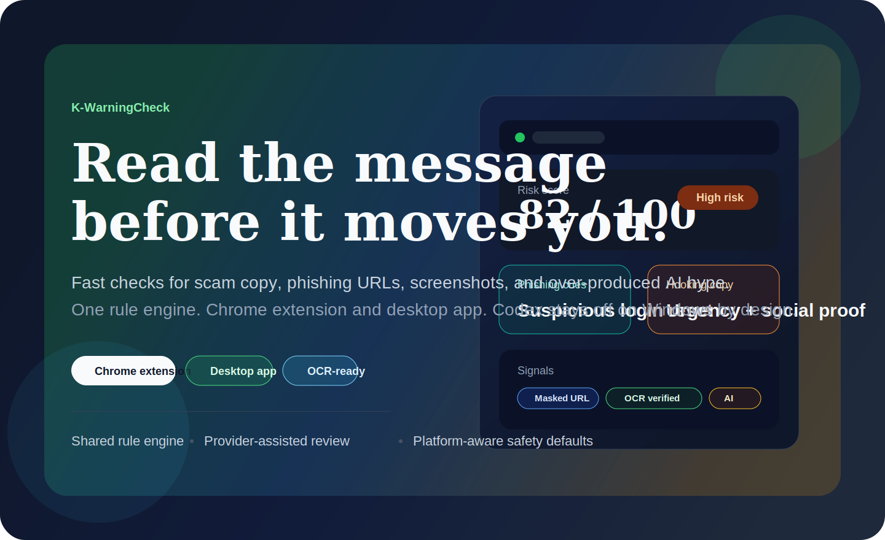
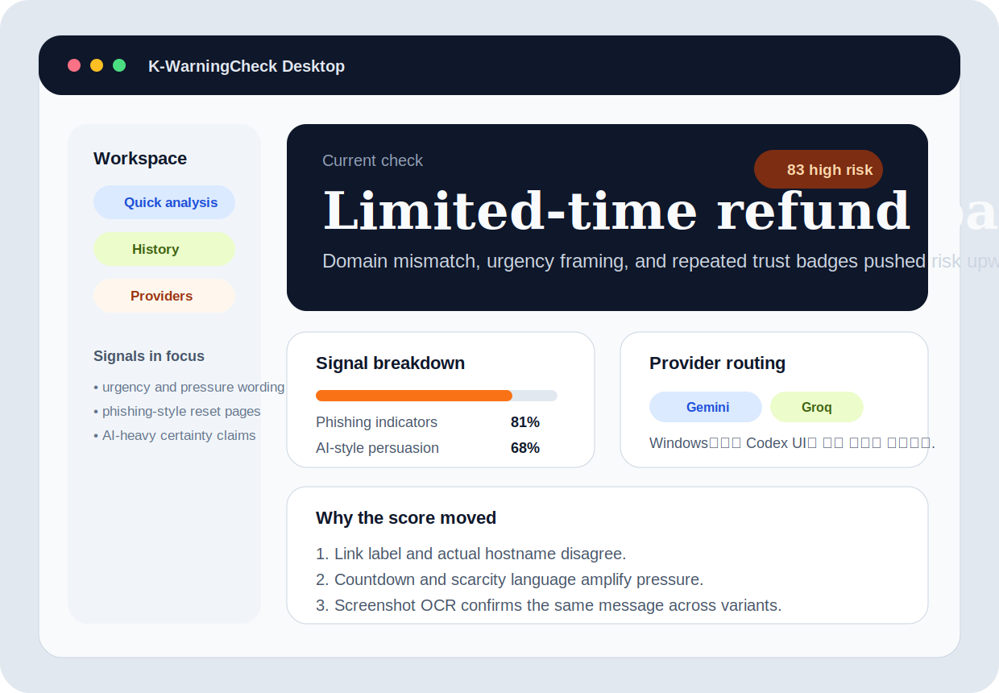
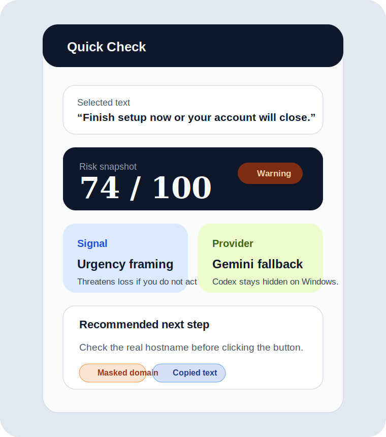
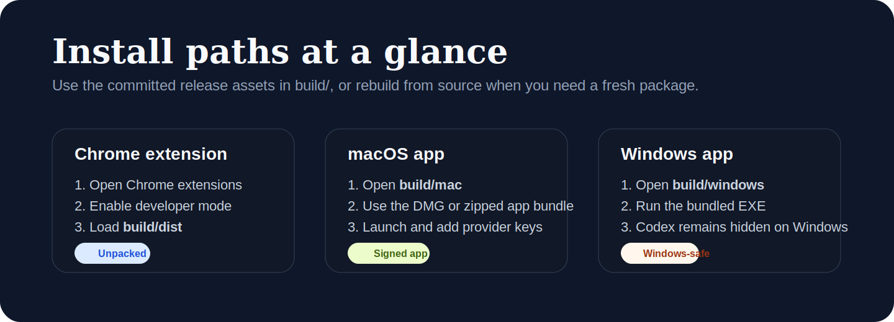

<p align="center">
  
</p>

<p align="center">
  Fast warning checks for suspicious copy, phishing URLs, screenshots, and AI-heavy hype.
</p>

<p align="center">
  <a href="README.ko.md">한국어 README</a>
  ·
  <a href="docs/INSTALL.md">Install Guide</a>
  ·
  <a href="docs/GITHUB-RELEASE.md">Release Draft</a>
  ·
  <a href="docs/ARCHITECTURE.md">Architecture</a>
</p>

<p align="center">
  
  
  
  
</p>

## What K-WarningCheck Is For

K-WarningCheck is built for one job: checking whether a message is trying too hard to make you click, install, pay, or trust it before you have time to inspect it.

It focuses on:

- phishing and scam copy that mimics normal operational language
- urgency-heavy promotional text designed to shortcut judgment
- AI-generated persuasion that sounds polished but weakens under inspection
- screenshots and clipped captures that need OCR before review

The same analysis engine powers both the Chrome extension and the desktop app, so the warning logic stays consistent across surfaces.

## Screens

| Desktop workspace | Extension quick check |
|---|---|
|  |  |



## Why It Works

- Shared rule engine for text, URL, clipboard, selection, image, and capture inputs
- OCR-first pipeline for screenshots and image-heavy messages
- Provider-assisted critique with Gemini, Groq, and Codex where supported
- Platform-aware safety defaults, including hidden Codex flows on Windows
- Secure OS-backed storage for provider keys
- Desktop workflows for manual review, history, clipboard checks, and capture

## Platform Matrix

| Surface | Status | Codex availability |
|---|---|---|
| Chrome on macOS / Linux / non-Windows | Supported | Available |
| Chrome on Windows | Supported | Hidden and disabled |
| Desktop on macOS | Supported | Available |
| Desktop on Windows | Supported | Hidden and disabled |

Windows intentionally ships without Codex UI, login, and connection flows.

## Install

<table>
  <tr>
    <td width="33%">
      <strong>Chrome extension</strong><br><br>
      Load <code>build/dist/</code> as an unpacked extension from <code>chrome://extensions</code>.<br><br>
      Optional local host install:<br>
      <code>npm run native:install</code>
    </td>
    <td width="33%">
      <strong>macOS app</strong><br><br>
      Open the files in <code>build/mac/</code>.<br><br>
      Use the DMG or the zipped app bundle, then launch and add provider keys.
    </td>
    <td width="33%">
      <strong>Windows app</strong><br><br>
      Run the executable from <code>build/windows/</code>.<br><br>
      Windows keeps Codex hidden and routes users toward Gemini or Groq.
    </td>
  </tr>
</table>

### Build From Source

```bash
npm install
npm run lint
npm run test
npm run build:extension
npm run build:mac
npm run build:windows
```

Raw build outputs are generated in `dist/`, `mac-app/`, and `windows-app/`. The repository-level handoff copies live in `build/`.

## Repository Shape

```text
k-warning-check/
├── build/       # release-ready extension and app files
├── docs/        # architecture, install, security, release draft, assets
├── main/        # shared frontend, extension runtime, renderer, native host scripts
├── tauri-app/   # Tauri v2 backend in Rust
├── README.md
├── README.ko.md
└── package.json
```

## Documentation

| Document | Description |
|---|---|
| [docs/INSTALL.md](docs/INSTALL.md) | Install paths, release assets, local build flow |
| [docs/ARCHITECTURE.md](docs/ARCHITECTURE.md) | Shared runtime structure, capability model, data flow |
| [docs/ANALYSIS-ENGINE.md](docs/ANALYSIS-ENGINE.md) | Rule engine, scoring, classification, checklist logic |
| [docs/CHROME-EXTENSION.md](docs/CHROME-EXTENSION.md) | Extension structure, runtime messages, local host integration |
| [docs/DESKTOP-APP.md](docs/DESKTOP-APP.md) | Desktop architecture, platform behavior, renderer and Rust commands |
| [docs/PROVIDERS.md](docs/PROVIDERS.md) | Gemini, Groq, Codex support rules |
| [docs/SECURITY.md](docs/SECURITY.md) | Secure storage, bridge token handling, repo hygiene |
| [docs/DEVELOPMENT.md](docs/DEVELOPMENT.md) | Setup, verification, packaging workflow |
| [docs/GITHUB-RELEASE.md](docs/GITHUB-RELEASE.md) | Copy-ready release body draft |

## FAQ

<details>
  <summary><strong>Why is Codex missing on Windows?</strong></summary>
  Windows deliberately hides Codex UI and blocks Codex bridge flows in both the extension and the desktop app. Compatibility fields remain in stored state, but the runtime does not use them on Windows.
</details>

<details>
  <summary><strong>Where are the distributable files?</strong></summary>
  The files meant for handoff live in <code>build/</code>. Raw local outputs still originate in <code>dist/</code>, <code>mac-app/</code>, and <code>windows-app/</code>.
</details>

<details>
  <summary><strong>Where are provider keys stored?</strong></summary>
  Provider keys are stored through OS-backed secure storage. Checked-in credentials, personal paths, and private certificates do not belong in the repository.
</details>

## Contributors

| Role | Contributor |
|---|---|
| Maintainer | [Habin Song](https://github.com/habinsong) |

## License

Private
