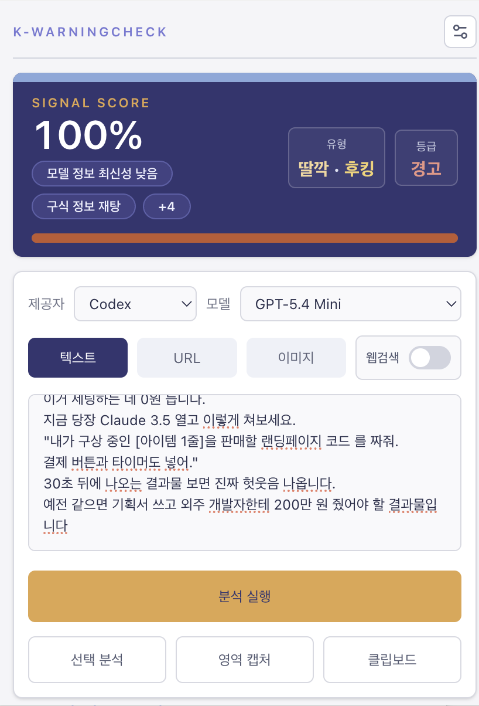

# 분석 엔진

K-워닝체크의 핵심인 규칙 기반 분석 엔진의 구조, 스코어링 로직, 분류 체계, AI 체크리스트를 설명합니다.

---

<p align="center">
  
</p>

---

## 분석 파이프라인

```
입력 텍스트
  │
  ├─ normalizeText()          유니코드 정규화, OCR 보정, 공백 정리
  ├─ detectTextLanguage()     한국어 / 영어 / 혼합 판별
  ├─ extractEntities()        URL, 전화번호, 계좌, 오픈채팅 링크 추출
  │
  ├─ matchRules()             40개+ 규칙 패턴 매칭
  ├─ matchCombos()            규칙 조합 패턴 매칭
  ├─ evaluateAiHookingChecklist()  AI 품질 체크리스트 (40개 항목)
  │
  ├─ calculateWarningScore()  가중치 합산 → 등급 산출
  ├─ classifySignals()        13가지 분석 유형 분류
  ├─ highlightEvidence()      증거 문장 추출
  ├─ generateExplanation()    요약, 설명, 권장 조치 생성
  └─ analyzeRisk()            선택한 LLM 1회 호출로 설명·근거 보강
```

---

## 탐지 규칙 (`main/src/data/rules.ts`)

### 규칙 구조

```typescript
interface RuleDefinition {
  id: string              // 'upfront-payment', 'guaranteed-return' 등
  title: string           // '선입금/보증금 요구', '수익 보장' 등
  category: RiskCategory  // 6개 카테고리 중 하나
  weight: number          // 가중치 (1~30)
  severity: RiskSeverity  // 'low' | 'medium' | 'high' | 'critical'
  patterns: RegExp[]      // 정규식 패턴 목록
  types: AnalysisType[]   // 매칭 시 분류되는 분석 유형
}
```

### 위험 카테고리 (6가지)

| 카테고리 | 설명 | 예시 규칙 |
|----------|------|----------|
| `financial` | 금융 위험 | 선입금 요구, 수익 보장, 고수익 미끼 |
| `identity` | 신원/개인정보 | 개인정보 수집, 기관 사칭, 계정 요구 |
| `urgency` | 긴급성/압박 | 시간 제한, 한정 수량, 선착순 |
| `social` | 사회공학 | 감정 호소, 비밀 유지, 지인 사칭 |
| `technical` | 기술 위험 | 앱 설치 유도, 원격 제어, 악성 링크 |
| `content` | 콘텐츠 품질 | AI 생성, 바이럴, 과장 표현 |

### 심각도 수준

| 심각도 | 의미 | 최소 점수 보장 |
|--------|------|---------------|
| `low` | 약한 신호 | 없음 |
| `medium` | 주의 필요 | 없음 |
| `high` | 높은 위험 | 없음 |
| `critical` | 즉시 주의 | 50점 이상 |

### 주요 규칙 예시

| ID | 제목 | 가중치 | 심각도 | 패턴 예시 |
|----|------|--------|--------|----------|
| `upfront-payment` | 선입금/보증금 요구 | 25 | critical | `선입금`, `보증금.*먼저`, `수수료.*선납` |
| `guaranteed-return` | 수익 보장 | 22 | critical | `수익.*보장`, `원금.*보장`, `100%.*수익` |
| `phishing-agency` | 기관 사칭 | 20 | critical | `금융감독원`, `경찰청`, `검찰.*수사` |
| `urgency-time-limit` | 시간 제한 압박 | 12 | high | `오늘까지`, `마감.*임박`, `지금.*아니면` |
| `ai-generated-low-quality` | AI 생성 저품질 | 8 | medium | 체크리스트 기반 |

### 콤보 규칙

두 개 이상의 규칙이 동시에 매칭될 때 추가 보너스를 부여합니다.

```typescript
interface ComboDefinition {
  id: string
  title: string
  requires: string[]       // 필요한 규칙 ID 목록 (모두 매칭 필요)
  bonus: number            // 추가 점수
  floor?: RiskGrade        // 최소 등급 보장
  types: AnalysisType[]    // 추가 분석 유형
}
```

예시:
- `선입금 요구` + `수익 보장` → 보너스 +15, 최소 등급 `위험`
- `기관 사칭` + `개인정보 수집` → 보너스 +12, 최소 등급 `매우 위험`

### 언어별 패턴

- 기본 패턴: 한국어 (`main/src/data/rules.ts`)
- 영어 패턴 오버라이드: `main/src/data/englishRulePatterns.ts`
- 언어 감지 결과에 따라 자동 전환

---

## 스코어링 (`main/src/modules/scorer/calculateWarningScore.ts`)

### 점수 산출 공식

```
최종 점수 = clamp(0, 100,
  Σ(매칭 규칙 가중치)
  + Σ(콤보 보너스)
  + AI 체크리스트 점수
  + 차원별 추가 점수
  - 안전 맥락 완화 (-12)
)
```

### 단계별 계산

1. **규칙 가중치 합산**: 매칭된 모든 규칙의 `weight` 합계
2. **콤보 보너스**: 콤보 규칙 조건 충족 시 `bonus` 추가
3. **AI 체크리스트 점수**: 체크리스트 결과에서 산출된 추가 점수
4. **차원별 점수**: 7개 차원 점수 중 높은 값이 있으면 추가
5. **안전 맥락 완화**: 안전한 맥락이 감지되면 -12점
6. **심각도 바닥**: `critical` 심각도 규칙 매칭 시 최소 50점 보장
7. **콤보 바닥**: 콤보의 `floor` 등급에 해당하는 최소 점수 보장
8. **클램핑**: 0~100 범위로 제한

### 등급 기준

```
0~19   → '낮음'
20~39  → '주의'
40~59  → '위험'
60~79  → '매우 위험'
80~100 → '경고'
```

### 7개 차원 점수

분석 결과에는 세부 차원별 점수가 포함됩니다:

| 차원 | 설명 |
|------|------|
| `scam` | 스캠/사기 관련 신호 강도 |
| `virality` | 바이럴/홍보성 신호 강도 |
| `aiSmell` | AI 생성 콘텐츠 의심도 |
| `factualityRisk` | 사실성 위험도 |
| `comparisonRisk` | 비교 왜곡 위험도 |
| `authorityAppeal` | 권위 호소 강도 |
| `hookingStyle` | 후킹성 문체 강도 |

---

## AI 후킹 체크리스트 (`main/src/data/aiHookingChecklist.ts`)

### 체크리스트 구조

```typescript
interface AiHookingChecklistItem {
  id: string
  category: AiHookingCategory  // 10개 카테고리
  title: string
  weakPatterns: RegExp[]       // 약한 신호 (0.5점)
  strongPatterns: RegExp[]     // 강한 신호 (1.0점)
}
```

### 10개 카테고리

| 카테고리 | 한글명 | 검사 내용 |
|----------|--------|----------|
| `recency` | 최신성 | "2024년 최신", "업데이트됨" 등 시점 주장 |
| `factuality` | 사실성 | "연구에 따르면", "통계적으로" 등 근거 없는 주장 |
| `exaggeration` | 과장 | "혁신적인", "엄청난", "미친 효과" |
| `comparison` | 비교왜곡 | "A보다 10배", "압도적 차이" |
| `viral` | 바이럴 | "꿀팁", "이것만 알면", "알려드립니다" |
| `lowQuality` | 저품질문체 | 과도한 이모지, 반복 강조, 숫자 나열 |
| `authority` | 권위팔이 | "전문가 추천", "공식 인증" |
| `difficulty` | 난이도 | "누구나 쉽게", "5분이면 완성" |
| `costPerformance` | 비용/성과 | "무료로", "가성비 최고", "월 100만원" |
| `techContext` | 기술맥락 | "AI 기반", "최첨단 기술", "알고리즘" |

### 체크리스트 결과

```typescript
interface AiHookingChecklistResult {
  totalScore: number           // 전체 점수 (0~40+)
  categoryScores: Record<AiHookingCategory, number>
  topFindings: ChecklistFinding[]  // 상위 발견 항목
  hasCriticalItems: boolean    // 심각한 항목 존재 여부
  items: ChecklistItemResult[] // 개별 항목 결과
}
```

---

## 분류 (`main/src/modules/classifier/classifySignals.ts`)

### 분류 로직

1. 매칭된 규칙과 콤보에서 `types` 수집
2. 각 분석 유형별 가중치 합산
3. 가중치 + 우선순위 기반 정렬
4. 최고 가중치 유형을 `primaryType`으로 선정
5. 나머지 상위 3개를 `secondaryTypes`로 선정

### 13가지 분석 유형

```typescript
type AnalysisType =
  | '피싱/기관사칭'     | '투자/코인/리딩방'
  | '도박/베팅'         | '대출/금융사기'
  | '보이스피싱/전화사기' | '허위광고/과장'
  | '바이럴/홍보성'      | '개인정보탈취'
  | '구인/알바사기'      | '악성코드/해킹'
  | '로맨스스캠'         | 'AI생성/저품질'
  | '기타'
```

---

## 설명 생성 (`main/src/modules/explanation/generateExplanation.ts`)

### 요약 구조

분석 유형에 따라 정형화된 요약 템플릿을 사용합니다:

```
[유형별 리드 문장]
[점수 기반 위험도 설명]
[매칭된 주요 규칙 나열]
[권장 조치 목록]
```

### 권장 조치 ID

| ID | 조치 내용 |
|----|----------|
| `do-not-send-money` | 절대 송금하지 마세요 |
| `verify-sender` | 발신자의 신원을 직접 확인하세요 |
| `report-to-authority` | 관할 기관에 신고하세요 |
| `check-official-site` | 공식 사이트에서 직접 확인하세요 |
| `do-not-click-link` | 의심스러운 링크를 클릭하지 마세요 |
| `do-not-install-app` | 요청받은 앱을 설치하지 마세요 |
| `protect-personal-info` | 개인정보를 제공하지 마세요 |
| `cross-check-facts` | 다른 출처로 사실 여부를 교차 검증하세요 |

---

## 공식 기준점 (`main/src/data/riskBaselines.ts`)

정부 및 공공기관의 공식 경고 기준과 매칭합니다:

- **warning.or.kr** (전기통신금융사기 예방)
- **금융감독원** 금융사기 경고
- **경찰청** 사이버수사 기준

---

## LLM 보조 단계 (`main/src/modules/analyzer/analyzeInput.ts`)

로컬 엔진이 먼저 점수, 등급, 유형을 확정한 뒤에만 LLM 보조 단계를 실행합니다.

원칙:

- 분석 1회당 선택한 provider 1개만 호출
- 원격 호출은 `analyzeRisk` 1회만 사용
- 점수와 유형은 LLM이 바꾸지 않음
- LLM은 `summaryOverrideText`, `llmAnalysis`, 선택적 최신성 코멘트만 채움

저장 결과:

- `providerUsage`: 호출 provider, 성공 여부, 소요 시간
- `llmAnalysis.responseText`: 실제 응답 전문
- `llmAnalysis.evidence`: 원문 인용 근거
- `webFreshnessVerification`: 지원 경로에서만 최신성 코멘트 저장

현재 최신성 경로:

- Gemini: 같은 `analyzeRisk` 호출 안에서 최신성 코멘트까지 처리 가능
- Groq: 단일 호출 모드에서는 최신성 검증을 건너뛰고 상태만 남김
- Codex: 웹 최신성 검증 미지원
- **KISA** 피싱 탐지 가이드라인

기준점 매칭 시 결과에 `matchedBaselines` 배열로 포함되어 공신력을 높입니다.

---

## 텍스트 파싱

### 정규화 (`normalizeText`)

1. 유니코드 제로폭 문자 제거
2. 따옴표 · 아포스트로피 통일
3. 연속 공백 · 줄바꿈 정리
4. OCR 보정 (`o픈채팅` → `오픈채팅`, `l등` → `1등` 등)

### 언어 감지 (`detectTextLanguage`)

- 한글 비율 > 30%: `'ko'`
- 영문 비율 > 60%: `'en'`
- 그 외: `'mixed'`

### 엔티티 추출 (`extractEntities`)

```typescript
interface TextEntities {
  urls: string[]          // 일반 URL
  shortenedUrls: string[] // 단축 URL (bit.ly, t.co 등)
  phoneNumbers: string[]  // 전화번호
  accounts: string[]      // 계좌번호
  openChatLinks: string[] // 카카오 오픈채팅 링크
  telegramLinks: string[] // 텔레그램 링크
}
```

---

## 테스트

분석 엔진의 각 모듈은 단위 테스트로 검증됩니다:

| 테스트 파일 | 검증 대상 |
|------------|----------|
| `analyzeText.test.ts` | 전체 분석 파이프라인 |
| `calculateWarningScore.test.ts` | 스코어링 로직 |
| `classifySignals.test.ts` | 분류 로직 |
| `normalizeText.test.ts` | 텍스트 정규화 |
| `detectTextLanguage.test.ts` | 언어 감지 |
| `localization.test.ts` | 로컬라이제이션 |

```bash
npm run test    # 전체 테스트 실행
```
