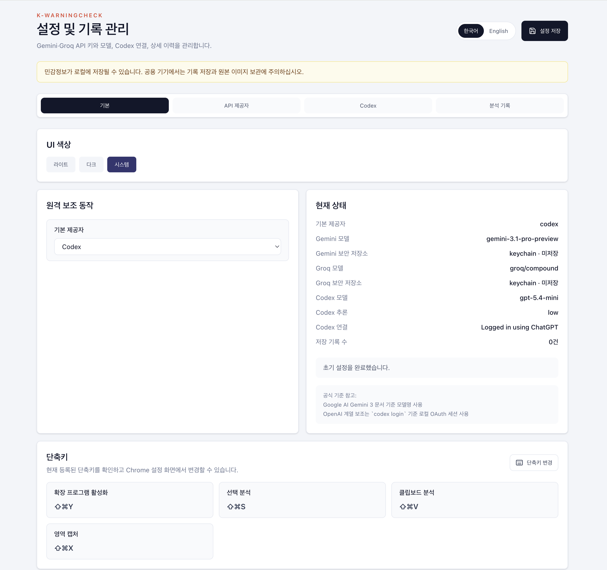

# Chrome 확장

Chrome 확장은 페이지 근처에서 빠르게 위험 신호를 확인하는 표면입니다. popup, options, background service worker, content script, offscreen 문서, native host로 구성됩니다.

---

## 실제 화면

<table>
  <tr>
    <td width="50%">
      
    </td>
    <td width="50%">
      
    </td>
  </tr>
  <tr>
    <td align="center"><strong>Popup 초기 화면</strong><br>설정 완료 전에는 안내와 최근 기록만 먼저 보여줍니다.</td>
    <td align="center"><strong>Options 기본 탭</strong><br>테마, 단축키, 기본 동작 정책을 한곳에서 관리합니다.</td>
  </tr>
</table>

<table>
  <tr>
    <td width="33%">
      
    </td>
    <td width="33%">
      
    </td>
    <td width="33%">
      
    </td>
  </tr>
  <tr>
    <td align="center"><strong>1단계</strong><br>분석 데모 확인</td>
    <td align="center"><strong>2단계</strong><br>언어 선택</td>
    <td align="center"><strong>3단계</strong><br>제공자 연결</td>
  </tr>
</table>

<table>
  <tr>
    <td width="33%">
      
    </td>
    <td width="33%">
      
    </td>
    <td width="33%">
      
    </td>
  </tr>
  <tr>
    <td align="center"><strong>제공자 설정</strong><br>Gemini, Groq 저장과 모델 선택</td>
    <td align="center"><strong>기록 관리</strong><br>각 분석 결과를 펼쳐 다시 검토</td>
    <td align="center"><strong>Codex 설정</strong><br>지원 플랫폼에서만 노출되는 예시 화면</td>
  </tr>
</table>

---

## 구성

```text
main/src/
├── background/   # 메시지 라우팅, 분석 호출, 기록 저장
├── popup/        # 빠른 분석 UI
├── options/      # 설정, 온보딩, 기록 관리
├── content/      # 선택 영역·캡처 오버레이 연동
└── offscreen/    # 클립보드·OCR 보조
```

---

## 역할 분담

### popup

- 텍스트, URL, 이미지 입력
- 최근 분석 결과와 짧은 기록 노출
- provider와 모델 선택

### options

- 온보딩
- API 키 저장
- 모델·테마·기록 관리
- 비윈도우 환경에서만 Codex 설정 탭 노출

### background

- 모든 런타임 메시지 처리
- 분석 서비스 오케스트레이션
- 로컬 저장소와 보안 저장소 연동
- Windows에서 Codex 메시지 즉시 차단

### native host

- OS 보안 저장소 접근
- 작업 디렉토리 및 로컬 host 정보 제공
- 비윈도우 환경에서만 Codex 관련 메시지 처리

---

## Windows 정책

Windows Chrome 확장에서는 다음을 노출하지 않습니다.

- Codex 온보딩 카드
- Codex 설정 탭
- Codex 연결 상태
- Codex 로그인 / 연결 시작 버튼
- Codex provider 선택지

상태 포맷 호환성을 위해 `codex` 필드는 남아 있지만, Windows에서는 bridge token을 주입하지 않습니다.

---

## 로컬 네이티브 호스트

```bash
npm run native:install
```

이 설치는 Chrome 확장의 로컬 host 연동을 준비합니다.

- 공통 용도: OS 보안 저장소 연동
- 비윈도우 Chrome 추가 용도: Codex 관련 bridge 흐름

사용자 노출 문구에서는 Codex 전용 호스트 대신 일반 로컬 호스트로 설명합니다.

---

## 메시지 흐름

| 메시지 | 설명 |
|---|---|
| `analyze-input` | 직접 입력 분석 |
| `analyze-active-selection` | 선택 텍스트 분석 |
| `capture-active-area` | 영역 캡처 시작 |
| `analyze-clipboard` | 클립보드 분석 |
| `get-provider-state` | 정규화된 provider 상태 조회 |
| `save-provider-state` | provider 상태 저장 |
| `get-runtime-capabilities` | 현재 플랫폼 capability 조회 |

Codex 관련 메시지는 Windows에서 오류로 종료됩니다.

---

## 빌드

```bash
npm run build:extension
```

원본 결과물은 `dist/`에 생성됩니다. 저장소에 함께 둘 배포 복사본이 필요하면 `build/dist/`로 정리합니다.

---

## 검증 포인트

- Windows Chrome에서 Codex UI가 보이지 않는지
- popup과 options의 provider 셀렉트에 Codex가 없는지
- `npm run native:install` 후 secure store 연동이 유지되는지
- 비윈도우 Chrome에서 기존 Codex 흐름이 유지되는지
