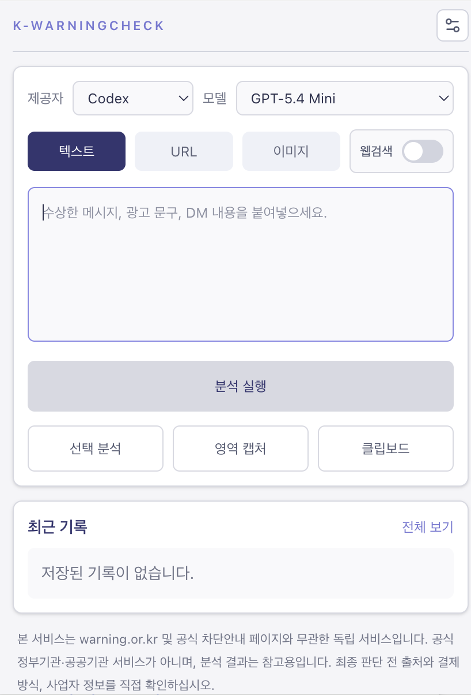

# 데스크톱 앱

데스크톱 앱은 Tauri v2 기반이며, React 렌더러와 Rust command 계층으로 나뉩니다. 수동 분석, 클립보드 분석, 화면 캡처, 기록 탐색, 글로벌 단축키가 핵심 기능입니다.

---

## 실제 화면

<table>
  <tr>
    <td width="50%">
      
    </td>
    <td width="50%">
      
    </td>
  </tr>
  <tr>
    <td align="center"><strong>분석 전</strong><br>입력 탭과 제공자 선택, 기본 워크플로를 먼저 보여줍니다.</td>
    <td align="center"><strong>분석 후</strong><br>시그널 스코어, 태그, 유형, 등급, 증거를 함께 확인합니다.</td>
  </tr>
</table>

<p align="center">
  
</p>

---

## 구성

```text
tauri-app/
├── src/commands/
│   ├── history.rs
│   ├── provider_state.rs
│   ├── provider_bridge.rs
│   ├── secure_store.rs
│   ├── system.rs
│   ├── capture.rs
│   └── codex.rs
└── src/lib.rs

main/src/desktop/renderer/
├── DesktopApp.tsx
├── services.ts
└── tauri-bridge.ts
```

---

## Rust 쪽 역할

- 기록 CRUD
- provider state 정규화
- API 키 저장 시 OS 보안 저장소 접근
- 실행 중 API 키용 로컬 암호화 캐시 읽기
- Gemini / Groq bridge 호출
- 시스템 기능
- 화면 캡처
- macOS 메뉴 막대 및 런처

Windows에서는 `codex.rs`가 stale 호출을 즉시 거절합니다.

---

## Capability 처리

데스크톱은 `kwc_system_get_runtime_capabilities` command로 capability를 제공합니다.

| OS | `supportsCodex` |
|---|---|
| macOS | `true` |
| Windows | `false` |

React 렌더러는 이 값을 기준으로:

- 온보딩 Codex 카드 렌더링 여부
- provider 선택지
- 설정 패널의 Codex 입력란
- Codex 연결 카드

를 함께 결정합니다.

---

## Windows 정책

Windows 데스크톱에서는 다음을 렌더링하지 않습니다.

- Codex provider 선택지
- Codex workspace path 입력
- Codex reasoning effort 설정
- Codex 연결 상태 및 로그인 버튼

기존 상태 파일에 `codex` 필드가 있어도 런타임은 이를 사용하지 않습니다.

---

## macOS 정책

macOS 데스크톱에서는 기존 Codex 흐름을 유지합니다.

- 상태 확인
- bridge 시작
- device-auth 로그인
- 메뉴 막대 런처

즉, 이번 정리는 Windows 비노출이 목적이며 macOS 기능 제거가 아닙니다.

---

## LLM 분석 표시

데스크톱의 기록 카드와 메인 결과 카드에는 `LLM 분석` 섹션이 함께 표시됩니다.

- 호출된 provider 이름
- 소요 시간
- 실제 응답 전문
- 근거 문구
- 최신성 코멘트 또는 실패 이유

점수와 유형은 로컬 엔진 기준을 유지하고, LLM은 설명만 보강합니다.

---

## 보안 저장 동작

Gemini와 Groq 키는 저장 시에만 OS 보안 저장소를 사용합니다.

- 저장 시: Keychain 또는 Credential Locker + 로컬 암호화 캐시 갱신
- 실행 시: 로컬 암호화 캐시만 읽음
- 캐시 없음: 비밀번호 창 대신 `다시 저장 필요` 오류

즉, 정상 저장 이후 분석을 반복해도 암호 창이 계속 뜨지 않아야 합니다.

---

## 빌드

```bash
npm run build:mac
npm run build:windows
```

원본 산출물 디렉터리:

- `mac-app/`
- `windows-app/`

배포용 복사본은 루트 `build/mac/`, `build/windows/`로 정리합니다.

---

## 검증 포인트

- Windows 빌드에서 Codex 관련 설정이 전혀 렌더링되지 않는지
- macOS 빌드에서 Codex 로그인과 bridge 흐름이 유지되는지
- provider state가 Windows에서 `gemini -> groq` 우선으로 정규화되는지
- Gemini/Groq 저장 후 분석 반복 시 OS 암호 창이 다시 뜨지 않는지
- 기록 카드에서 `LLM 분석` 응답 전문이 보이는지
