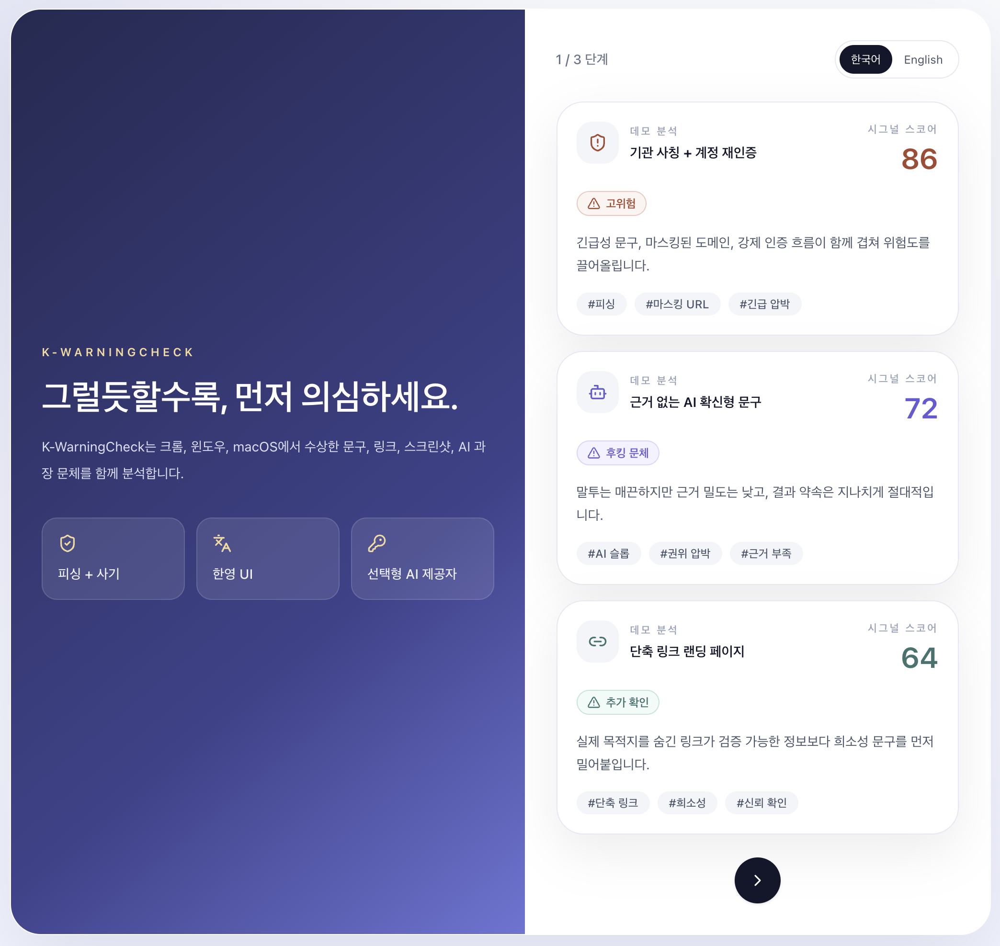
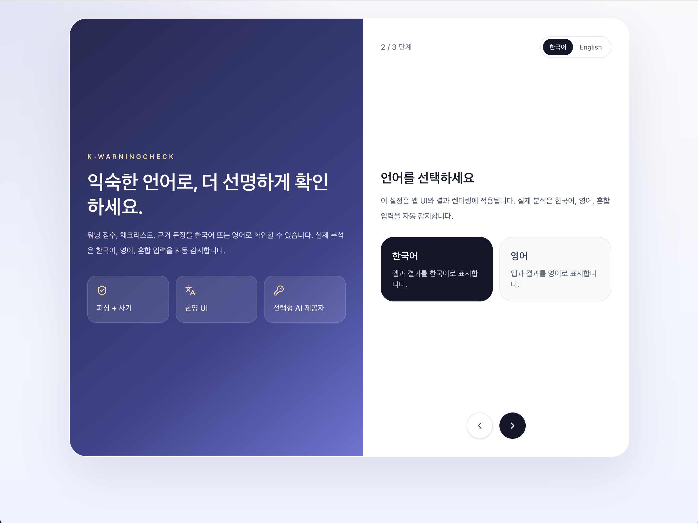
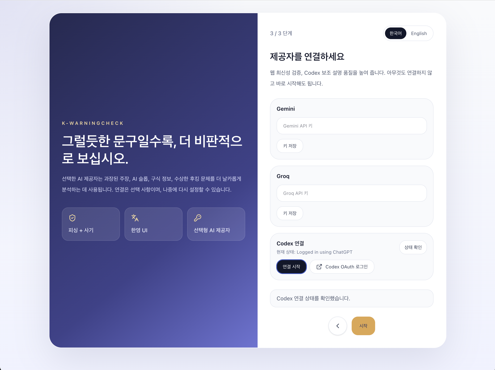
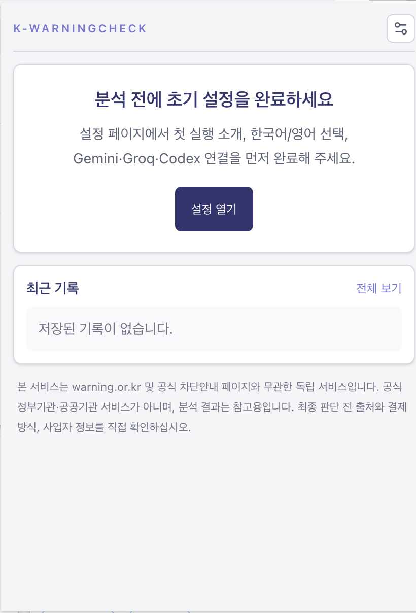
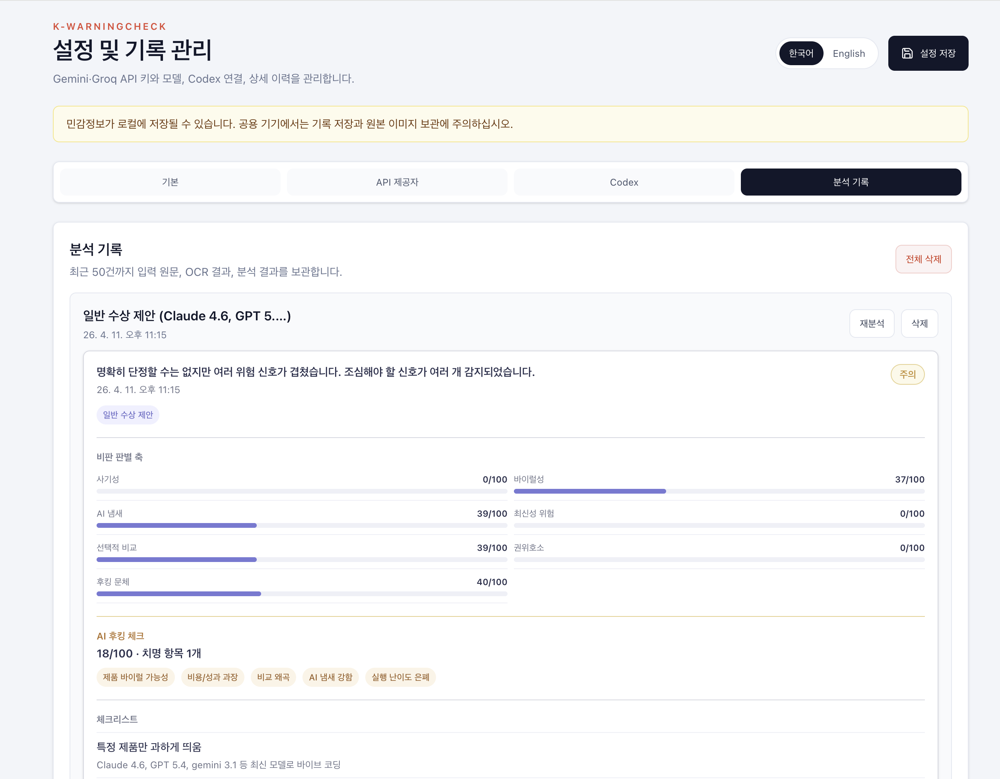

# 설치 안내

이 문서는 저장소에 함께 올려둔 배포 산출물과 소스 빌드 절차를 한 번에 정리한 안내 페이지입니다.

---

## 실제 첫 실행 화면

<table>
  <tr>
    <td width="33%">
      
    </td>
    <td width="33%">
      
    </td>
    <td width="33%">
      
    </td>
  </tr>
  <tr>
    <td align="center"><strong>1단계</strong><br>데모 분석 카드 확인</td>
    <td align="center"><strong>2단계</strong><br>언어 선택</td>
    <td align="center"><strong>3단계</strong><br>제공자 연결</td>
  </tr>
</table>

<p align="center">
  
</p>

---

## 가장 빠른 설치

루트 `build/` 폴더에는 바로 확인할 수 있는 배포 산출물을 정리해 둡니다.

| 대상 | 위치 | 사용 방법 |
|---|---|---|
| Chrome 확장프로그램 | `build/dist/` | Chrome 확장 관리 화면에서 압축해제 확장으로 불러오기 |
| macOS 앱 | `build/mac/` | `.dmg` 또는 압축된 `.app` 번들을 열어 설치 |
| Windows 앱 | `build/windows/` | `.exe` 실행 |

---

## Chrome 확장 설치

1. Chrome 주소창에 `chrome://extensions`를 엽니다.
2. 우측 상단의 개발자 모드를 켭니다.
3. `압축해제된 확장 프로그램을 로드합니다`.
4. 저장소의 `build/dist/`를 선택합니다.

추가로 로컬 보안 저장소 연동이 필요하면 아래 명령을 실행합니다.

```bash
npm run native:install
```

이 로컬 host는 secure store 연동에 사용됩니다. 비윈도우 Chrome에서는 Codex 관련 로컬 흐름도 함께 사용할 수 있지만, Windows에서는 Codex UI가 계속 숨겨집니다.

<p align="center">
  
</p>

---

## macOS 앱 설치

`build/mac/`에는 아래 중 하나 이상을 둡니다.

- `.dmg`
- 압축된 `.app`

설치 순서:

1. `.dmg`를 열거나 압축 파일을 풉니다.
2. 앱을 `Applications`로 옮깁니다.
3. 처음 실행 후 필요한 제공자 키를 입력합니다.

macOS 데스크톱에서는 Codex 연결 흐름을 계속 사용할 수 있습니다.

---

## Windows 앱 설치

`build/windows/`의 `.exe`를 실행합니다.

Windows 데스크톱에서는 다음 정책이 적용됩니다.

- Codex UI 비노출
- Codex 로그인 / 연결 버튼 비노출
- Gemini, Groq 중심 설정

즉, Windows에서는 Codex 없이 바로 분석 환경을 구성하는 방식으로 사용하면 됩니다.

---

## 소스에서 직접 빌드

### 요구 사항

- Node.js 20+
- npm 10+
- Rust 1.80+
- macOS에서 Windows 크로스 빌드 시 `cargo-xwin`

### 설치

```bash
npm install
```

### 검증

```bash
npm run lint
npm run test
cargo check --manifest-path tauri-app/Cargo.toml
```

### 산출물 생성

```bash
npm run build:extension
npm run build:mac
npm run build:windows
```

원본 빌드 출력은 아래 위치에 생성됩니다.

- `dist/`
- `mac-app/`
- `windows-app/`

배포용으로 저장소에 올릴 파일은 이 산출물에서 선별해 `build/`로 복사해 관리합니다.

---

## 제공자 설정

- Gemini: API 키 필요
- Groq: API 키 필요
- Codex: 지원 플랫폼에서만 노출

API 키는 OS 보안 저장소를 사용합니다. 저장소에는 실제 키를 남기지 않습니다.

실제 동작:

- 저장할 때만 OS 보안 저장소 인증이 필요할 수 있습니다.
- 이후 실행과 분석은 로컬 암호화 캐시를 사용하므로 암호 창이 반복되지 않습니다.
- 캐시가 없으면 설정에서 API 키를 다시 저장해야 합니다.

<table>
  <tr>
    <td width="50%">
      
    </td>
    <td width="50%">
      
    </td>
  </tr>
  <tr>
    <td align="center"><strong>제공자 설정</strong><br>Gemini, Groq, 지원 플랫폼의 Codex를 저장합니다.</td>
    <td align="center"><strong>분석 기록</strong><br>저장된 결과를 다시 열고, 재분석하거나 삭제합니다.</td>
  </tr>
</table>

---

## 설치 후 바로 확인할 항목

- Chrome 확장이 로드되는지
- 데스크톱 앱이 실행되는지
- provider 저장이 정상 동작하는지
- Windows에서 Codex UI가 보이지 않는지
- macOS에서 기존 Codex 흐름이 유지되는지

---

## 문제 해결

### 확장이 로드되지 않는 경우

- `build/dist/manifest.json` 존재 여부를 확인합니다.
- Chrome 개발자 모드가 켜져 있는지 확인합니다.

### 앱 실행 시 제공자 설정이 저장되지 않는 경우

- 로컬 host 설치 여부를 확인합니다.
- OS 보안 저장소 접근 권한이 차단되지 않았는지 확인합니다.
- 런타임 API 키 캐시가 없다는 오류가 나오면 설정에서 해당 키를 다시 저장합니다.

### Windows에서 Codex 관련 항목이 안 보이는 경우

정상입니다. 현재 정책상 Windows에서는 Codex UI와 연결 흐름을 노출하지 않습니다.
