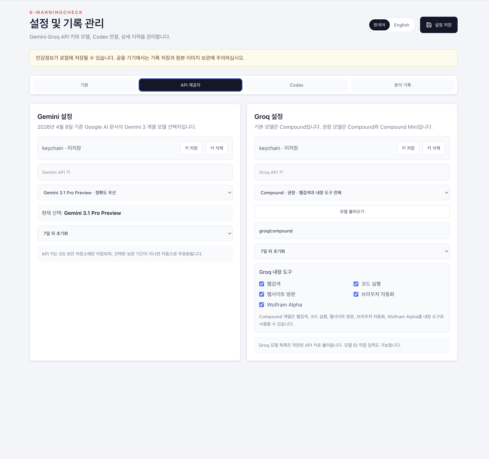
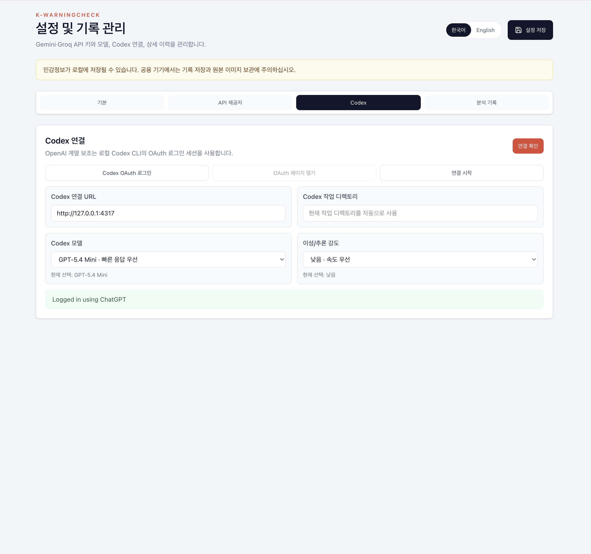

# 제공자

K-WarningCheck는 Gemini, Groq, Codex를 지원하지만, 현재 런타임 정책은 플랫폼별로 다릅니다.

---

## 설정 화면 예시

<table>
  <tr>
    <td width="50%">
      
    </td>
    <td width="50%">
      
    </td>
  </tr>
  <tr>
    <td align="center"><strong>Gemini / Groq 설정</strong> 모델, API 키 보관 정책, 도구 구성을 관리합니다.</td>
    <td align="center"><strong>Codex 설정</strong> 지원 플랫폼에서만 보이는 연결 예시 화면입니다.</td>
  </tr>
</table>

---

## 지원 매트릭스

| 제공자 | Chrome 비윈도우 | Chrome Windows | 데스크톱 macOS | 데스크톱 Windows |
|---|---|---|---|---|
| Gemini | 지원 | 지원 | 지원 | 지원 |
| Groq | 지원 | 지원 | 지원 | 지원 |
| Codex | 지원 | 비노출 | 지원 | 비노출 |

---

## Gemini

역할:

- 설명 보조
- 이미지 텍스트 추출 보조
- 웹 최신성 검증

설정 조건:

- API 키 필요
- OS 보안 저장소 저장 필요

---

## Groq

역할:

- 설명 보조
- 이미지 텍스트 추출 보조
- 일부 모델에서 웹 최신성 검증

설정 조건:

- API 키 필요
- OS 보안 저장소 저장 필요

---

## Codex

역할:

- bridge 기반 설명 보조
- bridge 기반 이미지 텍스트 추출

동작 조건:

- 로컬 bridge
- 로컬 로그인 세션
- 지원 플랫폼에서만 UI 노출

중요:

- Windows에서는 Codex UI와 연결 흐름을 노출하지 않습니다.
- 저장 포맷의 `codex` 필드는 남아 있지만, Windows 런타임은 bridge token을 주입하지 않습니다.

---

## Provider 선택 규칙

정규화 원칙:

- 웹 최신성 검증이 켜져 있으면 Gemini 또는 Groq 우선
- Windows에서는 Codex를 기본/fallback 후보에서 제거
- provider가 구성되지 않았으면 선택지에 남더라도 비활성화

---

## 이미지 분석

이미지 분석은 멀티모달 제공자가 필요합니다.

- 지원 플랫폼의 Codex
- 또는 Gemini
- 또는 Groq

Windows에서는 사실상 Gemini 또는 Groq가 필요합니다.

---

## 구현 포인트

- UI는 capability와 provider state를 함께 보고 렌더링합니다.
- 분석 엔진의 fallback 체인은 capability 기준으로 Codex를 제외할 수 있어야 합니다.
- provider state 정규화와 provider factory는 같은 플랫폼 정책을 따라야 합니다.
